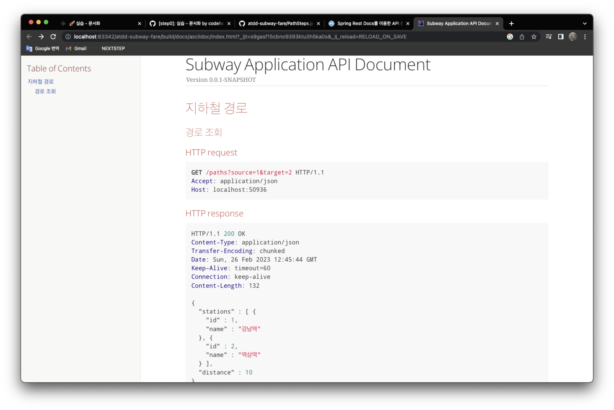

# 지하철 노선도 미션
[ATDD 강의](https://edu.nextstep.camp/c/R89PYi5H) 실습을 위한 지하철 노선도 애플리케이션

## STEP 0
  

## STEP 1
* [x] 경로 조회 시 최소 시간 기준으로 조회하는 기능 추가
* [x] 노선 추가 및 구간 추가 시 거리와 함께 소요 시간 정보도 추가
```text
Feature: 지하철 경로 검색

  Scenario: 두 역의 최소 시간 경로를 조회
    Given 지하철역이 등록되어있음
    And 지하철 노선이 등록되어있음
    And 지하철 노선에 지하철역이 등록되어있음
    When 출발역에서 도착역까지의 최소 시간 기준으로 경로 조회를 요청
    Then 최소 시간 기준 경로를 응답
    And 총 거리와 소요 시간을 함께 응답함
```

## STEP 2
* [x] 경로 조회 결과에 요금 정보를 포함
```text
Feature: 지하철 경로 검색

  Scenario: 두 역의 최단 거리 경로를 조회
    Given 지하철역이 등록되어있음
    And 지하철 노선이 등록되어있음
    And 지하철 노선에 지하철역이 등록되어있음
    When 출발역에서 도착역까지의 최단 거리 경로 조회를 요청
    Then 최단 거리 경로를 응답
    And 총 거리와 소요 시간을 함께 응답함
    And 지하철 이용 요금도 함께 응답함
```

## STEP 3
* [x] 노선별로 추가 요금 등록
* [x] 추가 요금이 있는 노선을 이용할 경우 측정된 요금에 추가
  * [x] 경로 중 추가요금이 있는 노선을 환승하여 이용할 경우 가장 높은 금액의 추가 요금만 적용
* [x] 로그인한 사용자의 경우 연령별 요금으로 계산