# 가장 빠른 도착 시간 예제

위와 같은 노선도가 존재하고 각 노선은 아래와 같이 설정되어 있다고 가정하자.

| 노선명   | 첫차  | 막차  | 간격(INTERVAL) |
| -------- | ----- | ----- | -------------- |
| 2호선    | 05:30 | 23:30 | **3**          |
| 신분당선 | 05:30 | 23:30 | **10**         |
| 3호선    | 05:30 | 23:30 | **5**          |

이 때 사용자가 06:15분에 `교대역` 에서 `양재역` 까지 가는 가장 빠른 도착 시간을 요청하면, 어떻게 응답해줄 것인가?

1. 먼저 출발역에서 도착역까지 가는 모든 경로를 구한다.
   - 교대역 -> 강남역 -> 양재역
   - 교대역 -> 남부터미널역 -> 양재역

2. 각 경로별 정차시간을 합한 최종 도착시간을 구한다.
   - 교대역 -> 강남역 -> 양재역
     - 06:15분 기준 2호선은 3분 간격으로 출발하므로 대기시간없이 바로 탑승이 가능하다.
     - **06:15분 교대역 2호선 탑승**
     - 교대역에서 강남역까지는 2분이 소요됨으로, **06:17분 강남역 도착**
     - 강남역에서 양재역으로가는 신분당선은 10분간격으로 출발하고, 강남역이 종점이으로 06:20분까지 대기한다.
     - **06:20분 강남역에서 신분당선 탑승**
     - 강남에서 신분당선을 타고 양재까지는 1분이 소요되므로 **06:21분 최종 목적지 도착**
   
   - 교대역 -> 남부터미널역 -> 양재역
     - 06:15분 기준 3호선은 5분 간격으로 출발하므로 대기시간없이 바로 탑승이 가능하다.
     - **06:15분 교대역 3호선 탑승**
     - 교대역에서 남부터미널역까지의 소요시간은 2분이므로 **06:17분 남부터미널역 도착**
     - 남부터미널역은 같은 3호선을 탑승할 것임으로 정차시간 계산이 필요없이 바로 출발한다. **06:17분 남부터미널역에서 3호선 출발**
     - 남부터미널역에서 양재역까지의 소요시간은 2분이므로 **06:19분 최종목적지인 양재역 도착**

결과적으로 가장 빠른 도착 경로는 `교대역 -> 남부터미널역 -> 양재역` 이 된다.

즉, 같은 호선을 타고 이동할 때는 따로 정차시간 계산을 필요없고, 다른 라인으로 갈아타는 **환승** 을 이용할 때는 `첫차 시간 + (간격 X n) + 종점에서 정차역까지의 소요시간` 을 이용해서 다음 출발 시간을 구하면 된다.

## 역방향 예제

이번에는 `양재역`에서 `교대역`으로 6시5분에 출발해서 가는 가장 빠른 도착시간 경로를 구해보자.

위와 마찬가지로 두가지 경로가 있다. 역방향의 경우에는 노선도 가장 뒤에서 부터 출발시간을 기준으로 소요시간을 더해 구하면 된다.

1. `양재역 -> 강남역 -> 교대역` 
   - 6시 5분 기준 양재역에서 출발하는 신분당선은 10분 간격이므로 6시 10분에 출발한다. 따라서 **6시 10분 양재역에서 탑승**
   - 소요시간은 1분이므로 강남역에 도착하는 시간은 1분뒤인 6시11분이다. **6시11분 강남역 도착**
   -  강남역에서 출발하는 열차는 3분간격으로 출발하므로 6시 12분에 출발한다. **6시12분 강남역 출발**
   - 강남역에서 교대역까지 소요시간은 2분으로 , 최종 목적지에 도착하는 시간은 **6시14분 교대역 도착**이다.
2. `양재역 -> 남부터미널역 -> 교대역`
   - 6시 5분 기준 양재역에서 출발하는 3호선은 5분 간격이므로 대기시간 없이 바로 출발한다. **6시 5분 양재역에서 탑승**
   - 소요 시간은 2분이므로 2분뒤인 **6시7분 남부터미널역 도착.**
   - 같은 노선이므로 대기시간없이 **6시 7분 남부터미널역 출발**
   - 소요시간은 2분이르모 2분뒤인 **6시 9분 최종 목적지 교대역 도착**
3. 따라서 최종 가장 빠른 도착 경로는 `양재역 -> 남부터미널역 -> 교대역` 순서이다.

